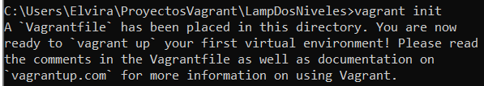
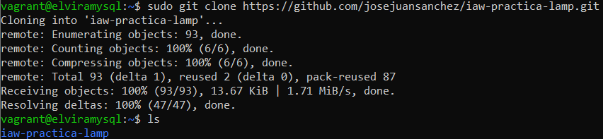
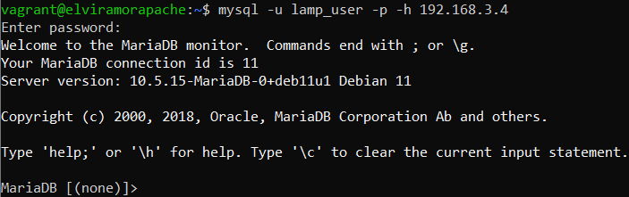

# ARQUITECTURA APLICACION WEB LAMP DOS NIVELES
 En esta práctica deberá automatizar la instalación y configuración de una aplicación web LAMP en dos máquinas virtuales, con la última versión de Ubuntu Server. En una de las máquinas deberá instalar Apache HTTP Server y los módulos necesarios de PHP y en la otra máquina deberá instalar MySQL Server. Ahora vamos a tener la pila LAMP repartida en dos máquinas virtuales, una se encargará de gestionar las peticiones web y la otra de gestionar la base de datos.      

* # CONFIGURACIÓN VAGRANT
Ante de comenzar realizaremos una carpeta en nuestro ProyectoVagrant para desplegar nuestras máquinas virtuales con el archivo "vagrantfile". Para ello creamos la carpeta que llamaremos LampDosNiveles con el siguiente comando: 

    mkdir LampDosNiveles

Para crearnos el "vagranfile" con su correspondiente configuración, primero haremos será meternos en nuestra carpeta la cual levantaremos las máquinas y utilizaremos el siguiente comando:

    vagrant init

Nos tendrá que aparecer en el terminal el siguiente mensaje, como que se ha creado correctamente el archivo "vagrantfile"

Modificaremos nuesto archivo "vagrantfile" para levantar nuestras dos máquinas virtuales generic/debian. La primera máquina tendrá una red privada con la dirección **(192.168.3.4)** que será la máquina en la que se encontrará el servidor mysql, mientras que en la segunda tendrá una red privada **(192.168.3.5)** más una red pública y será la máquina la cual instalaremos el servidor apache y php con todos sus módulo.

A partir de este momento, con la configuración de red creada de nuestros debians crearemos varios script de aprovisionamiento para automatizar descargas :

1. Descargar automáticamente paquete de Mysql (elviramormysql).

    
   
2. Descargar automáticamente paquete Apache, Php y Mysql Cliente con todos sus módulos (elviramorapache).

    

Una vez configurado el archivo vagrantfile, levantaremos las dos máquinas para ver si se nos han descargado correctamente los paquetes de Mysql, Apache, Php y Mysql Cliente. 

        vagrant up

También podemos utilizar el mismo cmando para levantar una a una las maquinas con el comando:

        vagrant up elviramysql
        vagrant up elviraapache
                             

* # CONFIGURACIÓN ELVIRAMYSQL (MAQUINA BACK-END)

En este momento empezaremos a configurar la máquina **elviramysql**, y nos conectaremos por ssh con el comando:

    vagrant ssh elviramysql

En primer lugar modificaremos el archivo **50-server.cnf** que se encuentra en la ruta:

    cd /etc/mysql/mariadb.conf.d

Y buscaremos la línea **bind-address** modificando la dirección que se encuentra por defecto 127.0.0.1 a la dirección de nuestro servidor mysql **192.168.3.4** 

 

Una vez cambiada la dirección realizaremos un restart a nuestro mysql con el comando, es muy importante realizarlo ya que nos podría darnos error al terminar la práctica y conectarnos a nuestra página web:

    sudo systemctl restart mysql

Ahora podremos empezar con la configuración de los archivos mysql, en primer lugar daremos de alta a un nuevo usuario, y le asignaremos unos privilegios. En este caso utilizaremos el usuario **root** el cual habíamos cambiado su contraseña en el script de aprovisionamiento, anteriormente creado.

    mysql -u root -p

Realizado los pasos anteriores, crearemos un usuario llamado **lamp_user** con su contraseña **lamp_password**, además le daremos unos privilegios solo parala base de datos **lamp_db**, para ello utilizaremos los siguientes comandos:

 

Para verificar que hemos creado bien el usuario nuevo, nos dirigiremos a la base de datos mysql y miraremos las tablas **user** y **host**

Una vez creado el usuario clonaremos el repositorio de [iaw-practica-lamp](https://github.com/josejuansanchez/iaw-practica-lamp.git), para obtener nuestro archivo de la base de datos, **database.sql**. Y al finalizar la configuración de la base de datos, borraremos la carpeta de **iaw-practica-lamp** para mayor seguridad.

Entraremos dentro de la carpeta **db** la base de datos que se encuentra el el repositorio clonado anteriormente y quitaremos las ultimas tres líneas que dan error al iniciar la base de datos por la creación de un usuario.

    cd /iaw-practica-lamp/db
    sudo nano database.sql

Una vez eliminado las líneas, procederemos a cargar la base de datos, y comprobar que se encuentra en nuestro mysql-server, :

    mysql -u root -p < database.sql
    mysql -u root -p

Al cargar la base de datos en nuestro servidor de mysql, por seguridad borraremos la carpeta **iaw-practica-lamp**

    sudo rm -r iaw-practica-lamp

 * # CONFIGURACIÓN ELVIRAAPACHE (MAQUINA FRONT-END)   
  
Una vez configurado la máquina con el Serivodor Apache, toca configurar la máquina con el servidor de Apache, Php y Mysql Cliente. 

Lo primero que se deberá crear será una carpeta llamada **LampDosNiveles** donde dentro de esta carpeta guardaremos el repositorio clonado de github, [iaw-practica-lamp](https://github.com/josejuansanchez/iaw-practica-lamp.git):

    sudo mkdir LampDosNiveles
    sudo chown -R www-data.www-data LampDosNiveles
    sudo git clone (URL-Repositorio)

Una vez clonado, veremos su contenido y todos los archivos de configuración que se encuentra en el directorio **src**, y los moveremos estos ficheros de configuración al directorio **LampDosNiveles** con el comando:

Al entrar en la carpeta y haber movido el contenido con el comando sudo, se queda regristado que el propietario = root y el grupo = root, por ello habría que cambiar otra vez el propietario y el grupo con el comando de utilizado antes.

Una vez movido el contenido de la carpeta iaw-practica-lamp al directorio LampDosNiveles, borraremos la carpeta iaw-practica-lamp.

    sudo rm -r iaw-practica-lamp

Con toda esta configuración realizada, pasaremos a darle forma a nuestra aplicación web con los archivos de configuración clonados anteriormente. Para ello utilizaremos los siguiente comandos:

    cd /etc/apache2/sites-available
    sudo cp 000-default.conf LampDosNiveles.conf
    sudo nano LampDosNiveles.conf
    sudo a2ensite LampDosNiveles.conf

Y cambiaremos la ruta de la línea **DocumentRoot /var/www/html** por **DocumentRoot /var/www/LampDosNiveles** que es la ruta de la carpeta que hemos creado anteriormente.

El siguiente paso será desactivar la página que viene por defecto en nuestra aplicación web, con los siguientes comandos:

    cd /etc/apache2/sites-enabled
    sudo a2dissite 000-default.conf

Antes de comprobar que funciona nuestra aplicación web deberemos configurar el archivo de **conf.php** , y modificaremos localhost por la ip de la máquina de mysql **192.168.3.4**

Una vez hecha esta configuración, en nuestro navegador, pondremos la dirección de nuestro servidor apache [http://192.168.3.5](http://192.168.3.5) y nos tendrá que redirigir a la página web donde podremos añadir, modificar y eliminar los usuarios de nuestra base de datos

 * # COMPROBACIONES ELVIRAMYSQL Y ELVIRAAPACHE

1. Lo primero que deberíamos hacer sería comprobar que las dos máquinas están en ejecución

    

2. Una vez que sabemos que las dos máquinas están en ejecución, veremos si en la máquina **elviramysql** está instalado correctamente y corriendo el servidor de mysql y el la máquina **elviraapache** si está instalado y corriendo el servidor apache2

    
    

3.  Una vez que hemos comprobado que las dos máquinas están en ejecución, deberíamos comprobar que están en la misma subred y que pueden verse entre sí haciendo uso del ping

    
    

4. Si las máquinas están en la misma subred y pueden verse entre sí, debemos comprobar que el puerto 3306 de la máquina donde se ejecuta MySQL está abierto. Con el comando:

        nc -v (ip elviramysql) (nº de puerto)

    

5. Si el puerto 3306 está abierto, podemos comprobar que el usuario de MySQL de la aplicación web puede conectarse desde la máquina de apache. Para ello utilizaremos el módulo de **mysql-client**, instalado anteriormente en el script de aprovisionamiento

    